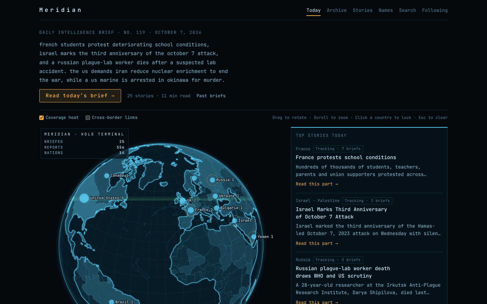
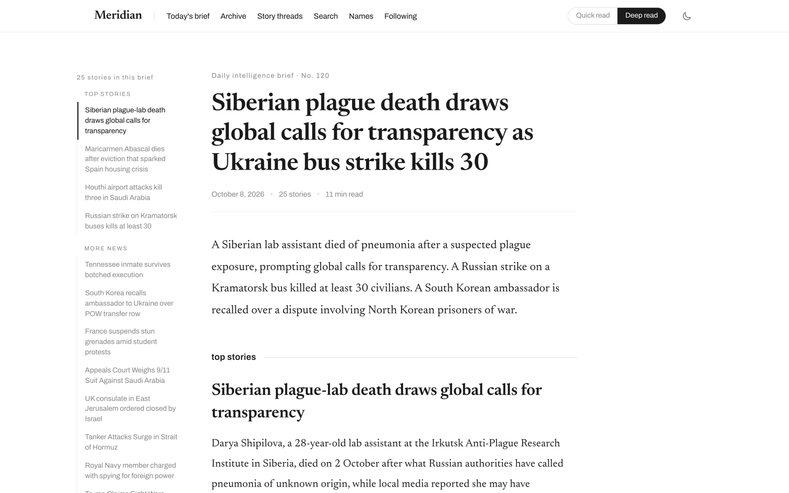
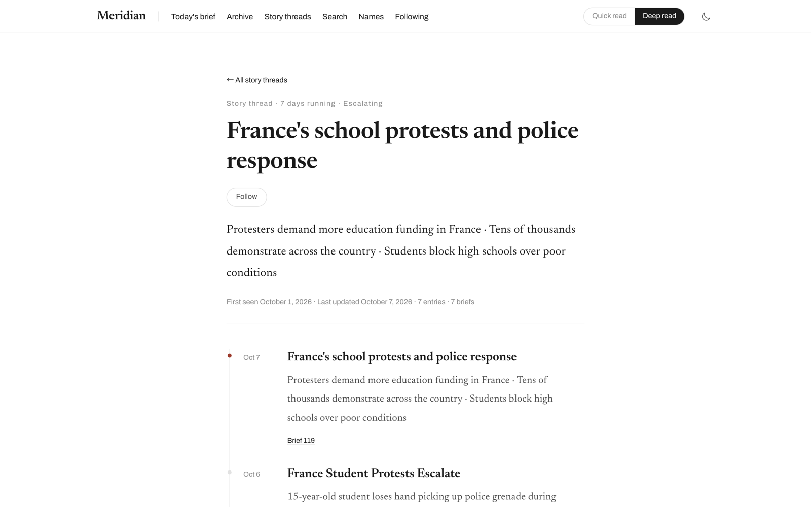
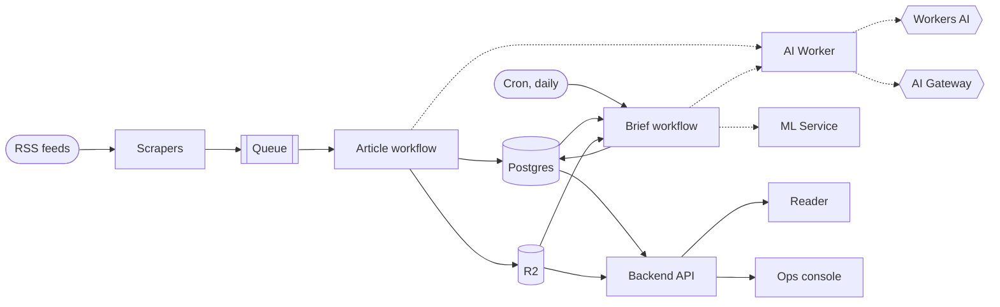
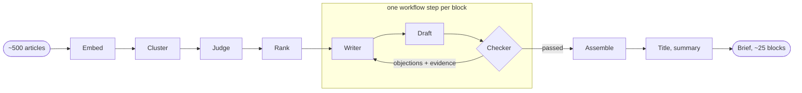

# Meridian

**A daily world-news brief that writes itself, with every sentence traceable to its sources.**

[](LICENSE)

Meridian reads a fixed set of news feeds, groups articles about the same event, and has an LLM write a few conclusion-first sentences per event. Each sentence carries citations back to the articles it came from, and a second model checks it against them before it is published. One brief comes out every day at 13:00 UTC, entirely on Cloudflare's developer platform.

**Live: [meridian-reader.pages.dev](https://meridian-reader.pages.dev)**

<p align="center">
  <a href="https://meridian-reader.pages.dev"></a>
</p>

## What you can read

| | |
|---|---|
| **Today on a map** | The latest brief placed on a globe, one dot per country a story is about |
| **The brief** | About 25 short blocks in three tiers, each a few sentences with source citations |
| **Story threads** | An event that keeps developing is followed across briefs, with a dated timeline |
| **Country and name pages** | Every block about a country, or about a person or organisation that most of its coverage mentions |
| **Search** | Full-text search over every published block |
| **Following** | Follow countries, names and threads; kept in the browser, no account |

<p align="center">
  
  
</p>

## How it works



Four deployable units on Cloudflare: a backend Worker (one Durable Object per feed, a queue, two Workflows, the API), an AI Worker that owns every model call, an ML service in a Container for embeddings and clustering, and a Nuxt app on Pages. Postgres (Neon, pgvector) holds metadata and published briefs; R2 holds article text and a record of every run.

The pipeline itself is a fixed workflow written in code. Models are not asked to run it. They are placed at the specific steps that need judgement, each with one narrow job, a small input and an output that code validates.



**The writer–checker loop** is the centre of it. A block is written from one cluster's articles by a writer model. Then every sentence of the draft goes to a checker, a different model, that looks only at that sentence and the cluster's source text and answers one question: is this supported, and if not, what is wrong and which source sentences show it. Objections go back into the writer's own conversation and it rewrites the block; only the changed sentences are checked again, for at most two rounds. If something fails along the way, the best version so far is published and the downgrade is recorded.

On a held-out set of 152 sentences reviewed blind, the writer alone got 6 wrong; with one round of checking 2; with two rounds none ([ADR 0010](docs/adr/0010-brief-block-writer-checker-loop.md)).

The checker began as a small agent with three retrieval tools over the cluster. In production the retrieval is now done by code, which assembles an evidence pack by fixed rules, and the model makes a single call on it; the agent remains as the fallback ([ADR 0012](docs/adr/0012-one-call-sentence-check.md)). Handing the whole writing step to one free-running agent was tried and dropped: fewer errors, but a third of the lead blocks never got written.

| Step | Who does it |
|---|---|
| Analyse an article | `qwen3-30b`, falling back to `glm-4.7-flash` |
| Group articles into events | Code: `multilingual-e5-small` embeddings, cosine agglomerative clustering |
| Is this cluster one event, and what is it | `glm-4.7-flash`, one call per cluster |
| Which events matter most | `glm-4.7-flash`, three shuffled rounds combined by Borda count |
| Write a block | `deepseek-v4-pro` |
| Check each sentence | `qwen3.8-flash` on an evidence pack built by code; fallback: a `qwen3.8-27b` agent with search, timeline and read tools |
| Tiers, order, citations, the final document | Code |

A typical run turns about 500 articles into 25 blocks in 10 to 30 minutes, for roughly 30,000 Workers AI neurons (about $0.33 at list price, not counting per-article analysis). The full pipeline is in [`docs/how-it-works.md`](docs/how-it-works.md).

## Built to run unattended

The happy path above is the small part. Most of the work is in what happens when something goes wrong, and in being able to tell.

- **Scraping that expects to be blocked.** Per-domain rate limiting, a browser-rendering fallback for pages that need it, and detectors for block pages, login walls and player shells so they are skipped instead of analysed. The detectors score precision 1.0 on a hand-labelled set.
- **Failures stay small and visible.** Each block is its own workflow step, because the platform cancels a small share of step invocations and one blip should not cost a whole brief. A step that cannot do its best publishes the best version it has and records the downgrade; a run with downgrades is marked degraded with the reasons.
- **Every model call is kept.** Request and response of each call go to R2, keyed by run. The ops console shows health, trends, cost and sources, and opens any run down to the individual model calls.
- **Any production run can be replayed.** A run's recorded model output is fed back through the whole workflow locally and the result compared field by field with what production wrote. It runs as a regression test on every push.
- **A staging copy that cannot touch production.** Its own database branch, reset from production before each run, its own bucket and queue. A check in the type-check step fails if the two environments share any resource.
- **Decisions are measured and written down.** Eleven hand-labelled test sets under [`eval/`](eval), and eighteen decision records in [`docs/adr/`](docs/adr). Each record gives the measurements and the list of approaches that were tried and dropped.
- **Over 700 automated tests** across the four units, run before every push and in CI.

As of October 2026: 14 feeds, 51,000 articles processed, 47 briefs published since August, and every scheduled run since the current pipeline went live on September 21 has completed.

## Stack

| Part | Built with |
|---|---|
| [`apps/backend`](apps/backend) | Cloudflare Workers, Durable Objects, Workflows, Queues, Hono |
| [`services/meridian-ai-worker`](services/meridian-ai-worker) | Every LLM call: Workers AI, plus DashScope through AI Gateway for the sentence check |
| [`services/meridian-ml-service`](services/meridian-ml-service) | FastAPI on a Cloudflare Container: embeddings and clustering |
| [`apps/frontend`](apps/frontend) | Nuxt 3 on Cloudflare Pages |
| [`packages/database`](packages/database) | Drizzle ORM, Neon Postgres with pgvector, via Hyperdrive |
| [`packages/contracts`](packages/contracts) | Types and constants shared across services |

## Running it yourself

You need Node 22, pnpm, Python 3.11 with [uv](https://github.com/astral-sh/uv), a Postgres with pgvector, and a Cloudflare account.

```bash
git clone https://github.com/QuantaOverflow/meridian.git
cd meridian
pnpm install
pnpm -F @meridian/database migrate   # needs DATABASE_URL
pnpm -F @meridian/backend dev
```

The rest of the local setup, the tests and each service's HTTP surface are in [`docs/development.md`](docs/development.md); deploying to your own Cloudflare account is in [`docs/deployment.md`](docs/deployment.md).

## Documentation

| | |
|---|---|
| [`docs/how-it-works.md`](docs/how-it-works.md) | The pipeline, step by step |
| [`docs/development.md`](docs/development.md) | Local setup, tests, API reference, configuration |
| [`docs/deployment.md`](docs/deployment.md) | Deploy order, staging, how to tell a deploy worked |
| [`docs/monitoring.md`](docs/monitoring.md) | Where data lands, the ops console, troubleshooting |
| [`docs/adr/`](docs/adr) | Architecture decision records, including what was tried and dropped |
| [`GLOSSARY.md`](GLOSSARY.md) | The project's vocabulary |

The four guides above are in English. The decision records, the glossary and commit messages are in Chinese, the working language of this project; see [`docs/README.md`](docs/README.md) for a map.

## How this repository is developed

Most of the code here was written by coding agents working under written rules and mechanical checks, with a human setting direction and reading the output. The rules are part of the repository: [`CLAUDE.md`](CLAUDE.md), path-scoped rules and hooks in [`.claude/`](.claude), and the workflow notes in [`docs/agents/`](docs/agents). Evaluation harnesses and hand-labelled test sets are in [`eval/`](eval).

`main` is what is running in production; development happens on `meridian-dev`. See [`CONTRIBUTING.md`](CONTRIBUTING.md).

## Origin

Meridian started from [iliane5/meridian](https://github.com/iliane5/meridian) by Iliane Amadou (MIT). The idea of an AI-written daily intelligence brief and the first Cloudflare Workers scaffold come from that project. Since then the pipeline, the models, the storage layout and the reader have been rewritten here.

## License

[MIT](LICENSE)
