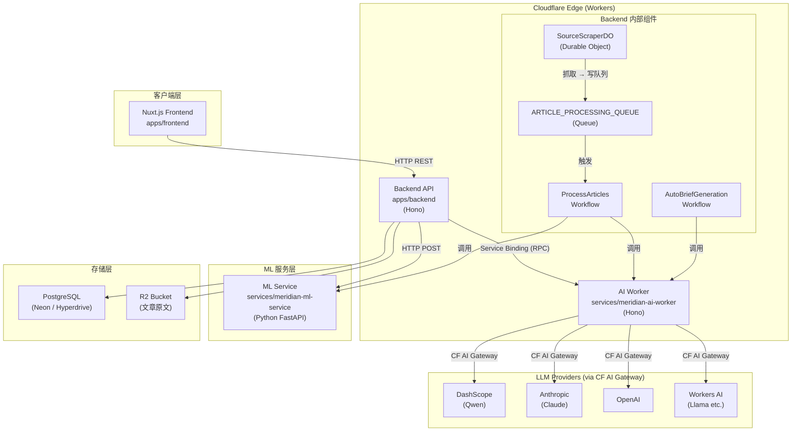
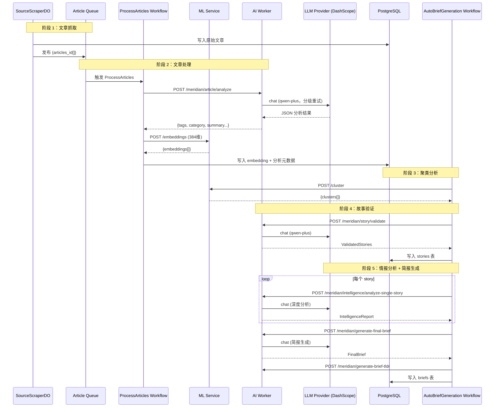

# System Architecture

## 整体架构图

```mermaid
graph TB
    subgraph Client["客户端层"]
        FE["Nuxt.js Frontend<br/>apps/frontend"]
    end

    subgraph CF_Edge["Cloudflare Edge (Workers)"]
        BE["Backend API<br/>apps/backend<br/>(Hono)"]
        AW["AI Worker<br/>services/meridian-ai-worker<br/>(Hono)"]

        subgraph BE_Internals["Backend 内部组件"]
            DO["SourceScraperDO<br/>(Durable Object)"]
            WF1["ProcessArticles<br/>Workflow"]
            WF2["AutoBriefGeneration<br/>Workflow"]
            Q["ARTICLE_PROCESSING_QUEUE<br/>(Queue)"]
        end
    end

    subgraph ML_Layer["ML 服务层"]
        ML["ML Service<br/>services/meridian-ml-service<br/>(Python FastAPI)"]
    end

    subgraph LLM_Providers["LLM Providers (via CF AI Gateway)"]
        DS["DashScope<br/>(Qwen)"]
        ANT["Anthropic<br/>(Claude)"]
        OAI["OpenAI"]
        WAI["Workers AI<br/>(Llama etc.)"]
    end

    subgraph Storage["存储层"]
        DB["PostgreSQL<br/>(Neon / Hyperdrive)"]
        R2["R2 Bucket<br/>(文章原文)"]
    end

    FE -- "HTTP REST" --> BE
    BE -- "Service Binding (RPC)" --> AW
    BE -- "HTTP POST" --> ML
    AW -- "CF AI Gateway" --> DS
    AW -- "CF AI Gateway" --> ANT
    AW -- "CF AI Gateway" --> OAI
    AW -- "CF AI Gateway" --> WAI
    DO -- "抓取 → 写队列" --> Q
    Q -- "触发" --> WF1
    WF1 -- "调用" --> AW
    WF1 -- "调用" --> ML
    WF2 -- "调用" --> AW
    BE --> DB
    BE --> R2
```

## 核心数据流（文章抓取 → 简报生成）

```mermaid
sequenceDiagram
    participant DO as SourceScraperDO
    participant Q as Article Queue
    participant WF1 as ProcessArticles Workflow
    participant ML as ML Service
    participant AW as AI Worker
    participant LLM as LLM Provider (DashScope)
    participant DB as PostgreSQL
    participant WF2 as AutoBriefGeneration Workflow

    Note over DO,Q: 阶段 1：文章抓取
    DO->>DB: 写入原始文章
    DO->>Q: 发布 {articles_id[]}

    Note over Q,AW: 阶段 2：文章处理
    Q->>WF1: 触发 ProcessArticles
    WF1->>AW: POST /meridian/article/analyze
    AW->>LLM: chat (qwen-plus，分级重试)
    LLM-->>AW: JSON 分析结果
    AW-->>WF1: {tags, category, summary...}
    WF1->>ML: POST /embeddings (384维)
    ML-->>WF1: {embeddings[]}
    WF1->>DB: 写入 embedding + 分析元数据

    Note over WF2,DB: 阶段 3：聚类分析
    WF2->>ML: POST /cluster
    ML-->>WF2: {clusters[]}

    Note over WF2,AW: 阶段 4：故事验证
    WF2->>AW: POST /meridian/story/validate
    AW->>LLM: chat (qwen-plus)
    AW-->>WF2: ValidatedStories
    WF2->>DB: 写入 stories 表

    Note over WF2,LLM: 阶段 5：情报分析 + 简报生成
    loop 每个 story
        WF2->>AW: POST /meridian/intelligence/analyze-single-story
        AW->>LLM: chat (深度分析)
        AW-->>WF2: IntelligenceReport
    end
    WF2->>AW: POST /meridian/generate-final-brief
    AW->>LLM: chat (简报生成)
    AW-->>WF2: FinalBrief
    WF2->>AW: POST /meridian/generate-brief-tldr
    WF2->>DB: 写入 briefs 表
```
