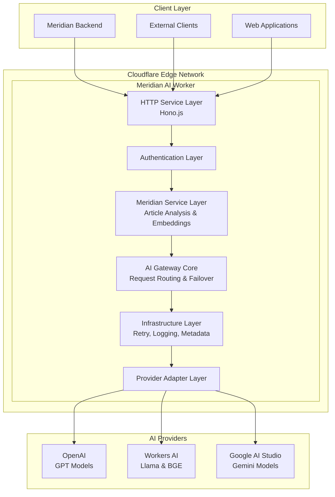
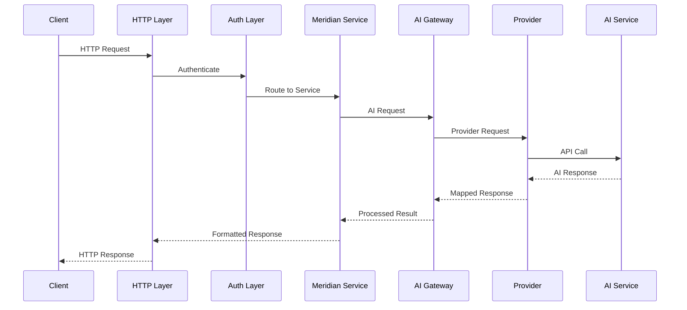
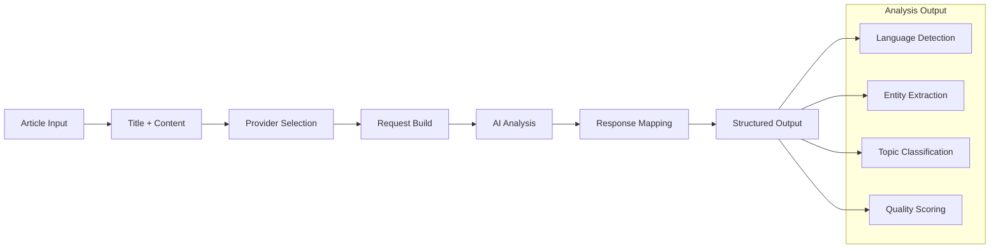
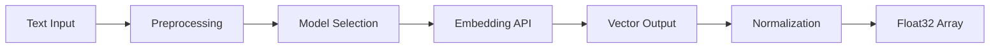
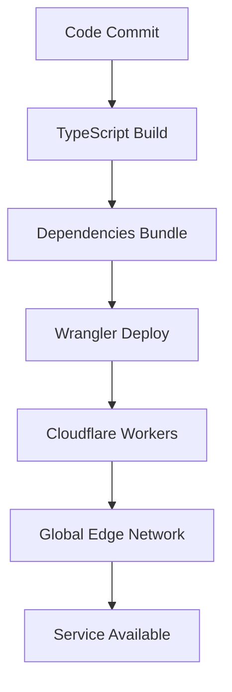

# Meridian AI Worker - 架构文档

## 📐 系统架构概览

Meridian AI Worker 采用分层架构设计，基于 Cloudflare Workers 平台构建，专为 Meridian 情报简报系统提供高性能的 AI 服务。

### 🏗️ 架构图



## 🔧 架构层次详解

### 1. HTTP 服务层 (HTTP Service Layer)

**技术栈**: Hono.js Framework
**职责**:
- HTTP 请求路由和处理
- CORS 中间件管理
- 请求/响应格式验证
- RESTful API 端点暴露

**关键文件**: `src/index.ts`

```typescript
// 核心路由结构
const app = new Hono<HonoEnv>()

// Meridian 专用端点
app.post('/meridian/article/analyze', ...)
app.post('/meridian/embeddings/generate', ...)
app.get('/meridian/config', ...)

// 通用 AI 端点
app.post('/ai/*', ...)
app.get('/health', ...)
app.get('/providers', ...)
```

### 2. 认证层 (Authentication Layer)

**技术栈**: 自定义认证服务
**职责**:
- API 密钥验证
- AI Gateway 令牌认证
- 请求权限控制
- CORS 头部管理

**关键文件**: `src/services/auth.ts`

**认证方式**:
- Bearer Token 认证
- X-API-Key 头部认证
- AI Gateway 专用令牌
- 可选的请求签名验证

### 3. Meridian 服务层 (Meridian Service Layer)

**技术栈**: TypeScript 业务逻辑
**职责**:
- 文章内容分析
- 向量嵌入生成
- 业务逻辑封装
- 结果格式标准化

**关键组件**:

#### MeridianAIWorkerService 类
```typescript
class MeridianAIWorkerService {
  // 文章分析服务
  async analyzeArticle(params: {
    title: string
    content: string
    options?: { provider?: string, model?: string }
  })
  
  // 嵌入生成服务
  async generateEmbedding(params: {
    text: string
    options?: { provider?: string, model?: string }
  })
  
  // 健康检查
  async healthCheck()
}
```

**默认配置**:
- 文章分析: Google Gemini 1.5 Flash 8B (成本优化)
- 嵌入生成: Workers AI BGE-Base-EN-v1.5 (边缘计算)

### 4. AI Gateway 核心层 (AI Gateway Core)

**技术栈**: Cloudflare AI Gateway + 自定义路由
**职责**:
- 请求路由和负载均衡
- 提供商选择和故障转移
- Universal AI Gateway 接口
- 模型能力匹配

**关键文件**: `src/services/ai-gateway.ts`

**核心功能**:
- 统一的 AI 请求处理
- 自动提供商选择
- 故障转移机制
- 请求格式转换

### 5. 基础设施层 (Infrastructure Layer)

**技术栈**: 自定义基础设施服务
**职责**:
- 请求重试机制
- 结构化日志记录
- 元数据管理
- 性能监控

**关键服务**:

#### 重试服务 (Retry Service)
```typescript
// 指数退避重试策略
const retryConfig = {
  maxRetries: 3,
  baseDelayMs: 1000,
  maxDelayMs: 30000,
  exponentialBase: 2
}
```

#### 日志服务 (Logger Service)
```typescript
// 结构化日志输出
logger.log('info', 'Request processed', {
  requestId,
  provider,
  model,
  processingTime,
  tokenUsage
})
```

#### 元数据服务 (Metadata Service)
```typescript
// 请求元数据管理
const metadata = {
  requestId: crypto.randomUUID(),
  timestamp: Date.now(),
  source: { origin: 'meridian-backend' }
}
```

### 6. 提供商适配层 (Provider Adapter Layer)

**技术栈**: 抽象工厂模式 + 适配器模式
**职责**:
- AI 提供商抽象
- 请求/响应格式转换
- 模型配置管理
- 错误处理统一

**关键文件**: `src/services/providers/`

#### 基础提供商接口
```typescript
interface BaseProvider {
  getSupportedCapabilities(): AICapability[]
  buildRequest(request: AIRequest): AIGatewayRequest
  mapResponse(response: any, originalRequest: AIRequest): AIResponse
  getDefaultModel(capability: AICapability): string
}
```

#### 提供商实现

**OpenAI 提供商** (`openai.ts`):
- GPT 系列对话模型
- Text Embedding 嵌入模型
- DALL-E 图像生成
- TTS 语音合成

**Workers AI 提供商** (`workers-ai.ts`):
- Llama 对话模型
- BGE 嵌入模型
- DreamShaper 图像生成
- 边缘计算优化

**Google AI 提供商** (`google-ai.ts`):
- Gemini 系列对话模型
- 成本效益优化
- 多语言支持

## 🔀 数据流架构

### 请求处理流程



### 文章分析流程



### 嵌入生成流程



## 🔄 故障转移机制

### 提供商优先级

```typescript
const providerPriority = {
  'chat': ['google-ai-studio', 'openai', 'workers-ai'],
  'embedding': ['workers-ai', 'openai'],
  'image': ['openai', 'workers-ai']
}
```

### 故障转移策略

1. **健康检查**: 定期检查提供商可用性
2. **错误分类**: 区分可重试和不可重试错误
3. **自动切换**: 主提供商失败时自动切换
4. **性能监控**: 跟踪成功率和响应时间

## 📊 性能优化

### 缓存策略

```typescript
// 缓存配置
const cacheConfig = {
  ttl: 3600,          // 1小时缓存
  keyPrefix: 'meridian-ai',
  enableCompression: true,
  maxSize: '10MB'
}
```

### 边缘计算优化

- **地理分布**: Cloudflare 全球边缘网络
- **Workers AI**: 边缘推理降低延迟
- **智能路由**: 基于地理位置的提供商选择

### 成本优化

- **模型选择**: 默认使用成本效益最高的模型
- **Token 跟踪**: 精确的使用量监控
- **批处理**: 合并相似请求降低成本

## 🔒 安全架构

### 认证安全

- **多层认证**: API Key + AI Gateway Token
- **权限控制**: 基于来源的访问控制
- **请求签名**: 可选的请求完整性验证

### 数据安全

- **传输加密**: HTTPS/TLS 1.3
- **敏感数据**: 避免日志记录敏感信息
- **访问审计**: 完整的请求审计跟踪

## 📈 监控和可观测性

### 关键指标

- **可用性**: 99.9% 目标 SLA
- **延迟**: P99 < 5s
- **错误率**: < 1%
- **成本**: Token 使用量跟踪

### 日志结构

```json
{
  "timestamp": "2024-01-15T10:30:00Z",
  "level": "info",
  "requestId": "req-12345",
  "provider": "google-ai-studio",
  "model": "gemini-1.5-flash-8b-001",
  "capability": "chat",
  "processingTime": 1250,
  "tokenUsage": {
    "input": 100,
    "output": 50,
    "total": 150
  },
  "cost": 0.0012,
  "status": "success"
}
```

## 🔧 配置管理

### 环境配置层次

1. **生产环境**: Cloudflare Workers 环境变量
2. **开发环境**: `.dev.vars` 文件
3. **默认配置**: 代码中的默认值
4. **运行时配置**: 动态配置更新

### 配置验证

```typescript
// 配置验证逻辑
const validateConfig = (env: CloudflareEnv) => {
  const required = [
    'CLOUDFLARE_ACCOUNT_ID',
    'CLOUDFLARE_GATEWAY_ID', 
    'CLOUDFLARE_API_TOKEN'
  ]
  
  for (const key of required) {
    if (!env[key]) {
      throw new Error(`Missing required config: ${key}`)
    }
  }
}
```

## 🚀 部署架构

### 部署流程



### 环境管理

- **开发环境**: 本地 Wrangler Dev
- **测试环境**: Staging Workers
- **生产环境**: Production Workers
- **监控**: Real-time health checks

## 📝 技术决策记录

### 为什么选择 Hono.js?

- **性能**: 比 Express 快 4x
- **TypeScript**: 原生 TypeScript 支持
- **边缘优化**: 专为 Workers 设计
- **中间件**: 丰富的中间件生态

### 为什么使用 Provider 适配器模式?

- **扩展性**: 易于添加新的 AI 提供商
- **维护性**: 统一的接口和错误处理
- **测试性**: 可以使用 Mock Provider 测试
- **灵活性**: 支持不同的请求/响应格式

### 为什么默认使用 Google AI?

- **成本效益**: Gemini Flash 8B 成本最低
- **性能**: 满足 Meridian 的分析需求
- **可靠性**: Google 基础设施保障
- **多语言**: 支持中文内容分析

## 🔮 未来扩展规划

### 短期目标 (1-3个月)

- [ ] 添加 Anthropic Claude 支持
- [ ] 实现请求批处理优化
- [ ] 增强监控和告警
- [ ] 性能基准测试

### 中期目标 (3-6个月)

- [ ] 多租户支持
- [ ] 自定义模型微调
- [ ] A/B 测试框架
- [ ] 智能成本优化

### 长期目标 (6-12个月)

- [ ] 边缘推理优化
- [ ] 自适应模型选择
- [ ] 预测性故障转移
- [ ] 高级分析仪表板

---

## 📚 相关文档

- [API 使用指南](../README.md#api-使用指南)
- [部署配置](../QUICK_DEPLOY.md)
- [故障排除](../COMPREHENSIVE_GUIDE.md#故障排除)
- [性能优化](./PERFORMANCE.md)
- [安全最佳实践](./SECURITY.md) 